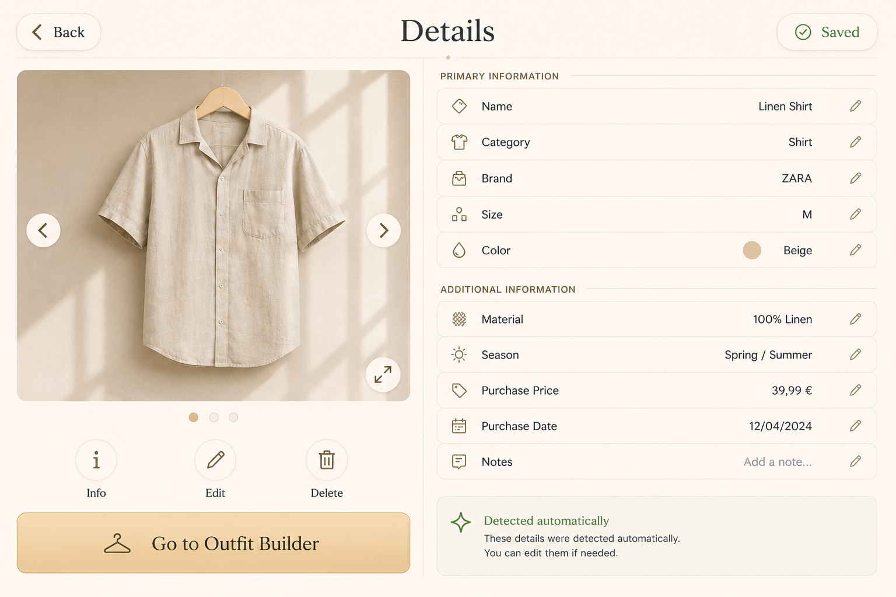

# Clothing Details Screen

## Purpose

The Clothing Details screen allows the user to inspect and manage all information associated with one garment.

Its purpose is to provide a clear visual overview of the garment, display its metadata, allow controlled editing, and preserve continuity with Wardrobe and Outfit Builder.

---

## Approved Visual Reference



This mockup is the official visual reference for the Clothing Details screen.

---

## Screen Summary

The Clothing Details screen can be explained in one sentence:

> View and manage the information attached to a garment.

Opening Outfit Builder remains available for continuity, but it is not the primary purpose of this screen.

---

## Header

The upper section contains:

- A `Back` button in the upper-left corner
- The page title `Details` centered at the top
- A save-status control in the upper-right corner
- A subtle champagne divider beneath the title

### Back Button

The Back button returns to Wardrobe.

Muse must restore the previous Wardrobe state, including:

- Selected category
- Selected garment
- Carousel position
- Grid or carousel view where appropriate

The user must return to the same context rather than the beginning of Wardrobe.

---

## Save Status

The upper-right control communicates whether garment information has been saved.

### Saved

Display:

```text
Saved
```

Visual state:

- Green outline
- Green confirmation icon
- Calm, non-animated appearance

### Unsaved Changes

Display:

```text
Unsaved changes
```

Visual state:

- Warm warning color
- Clear save action
- No aggressive flashing

### No Changes

When the user has not entered Edit mode or changed any information:

- The control may remain neutral
- It may display `Saved`
- It must not suggest that an action is required

### Save Behavior

When the user changes information:

1. The state becomes `Unsaved changes`.
2. The user confirms the changes through the save control.
3. Muse validates the information.
4. The changes are written to local storage.
5. The state becomes `Saved`.

Leaving the screen with unsaved changes must trigger a confirmation dialog.

---

## Main Layout

The screen is divided into two primary sections:

1. Garment imagery and local actions on the left
2. Garment information on the right

The sections must remain visually balanced.

The left side prioritizes the garment itself.

The right side prioritizes readable, structured metadata.

---

## Garment Image Panel

The left panel contains:

- Large garment image
- Previous image button
- Next image button
- Carousel indicators
- Fullscreen button
- Quick-action buttons
- Outfit Builder continuity button

The garment image must occupy most of the panel.

It should:

- Remain centered
- Preserve its proportions
- Avoid unnecessary cropping
- Use a clean neutral background
- Support several images when available

Several images means several logical source photographs. Original, normalized,
thumbnail, and cutout variants of one photograph are not separate carousel
slides. For each logical image, the UI chooses cutout, then normalized, then the
exact original as a fallback.

---

## Image Carousel

When a garment has several images, the user can navigate through them using:

- Left arrow
- Right arrow
- Horizontal swipe

Visible arrows must remain available even when swipe is supported.

### Carousel Indicators

Circular indicators beneath the image show:

- Number of available images
- Current image position

The active indicator uses the champagne accent.

Inactive indicators use a muted beige tone.

---

## Fullscreen Image View

The fullscreen button expands the image carousel.

When activated:

- The image occupies most of the screen
- Information panels are temporarily hidden
- Left and right navigation remain available
- Swipe remains available
- Carousel indicators remain visible
- The fullscreen control becomes a reduce control

Leaving fullscreen must restore:

- Current image
- Current carousel position
- Current editing state
- Unsaved changes

Fullscreen mode must not reload the garment.

---

## Quick Actions

Quick actions use round buttons.

### Information

The Information button may:

- Focus the information section
- Open a short metadata summary
- Help the user return to the information panel after fullscreen viewing

It must not duplicate the entire page unnecessarily.

### Edit

The Edit button enables editing.

By default:

- Information fields are read-only
- Accidental changes are impossible
- The user can inspect everything safely

After pressing Edit:

- Editable fields become active
- Editable controls receive clear visual feedback
- The save state can become `Unsaved changes`
- A Cancel option must be available

### Delete

The Delete button removes the garment from Muse.

Before deletion, display a confirmation dialog containing:

- Garment name
- Clear explanation
- Cancel action
- Confirm deletion action

Suggested message:

```text
Delete Linen Shirt?

This garment will disappear from your wardrobe. Saved outfits may still retain
a reference to it.
```

Deletion is a soft delete. Existing saved outfits retain a readable deleted
reference and its image metadata; the action does not purge original media.

Deletion must never happen after one accidental press.

---

## Outfit Builder Continuity

The rectangular `Go to Outfit Builder` button allows the user to continue from garment inspection into outfit creation.

This is a secondary continuity action.

When pressed:

1. Muse opens Outfit Builder.
2. The current garment is added automatically.
3. The garment is assigned to its correct body category.
4. The Outfit Builder preserves the origin context.
5. The current garment details remain saved before navigation.

Examples:

```text
Hat        → Head
Shirt      → Top
Dress      → Top or Full Body
Pants      → Pants
Shoes      → Shoes
Accessories → Relevant accessory layer
```

If unsaved changes exist, Muse must ask the user to save or discard them before opening Outfit Builder.

---

## Information Structure

The right panel separates garment data into two groups.

---

## Primary Information

Primary Information contains the most important garment attributes:

- Name
- Category
- Brand
- Size
- Color

These fields must be immediately visible without scrolling at the target resolution.

### Name

Example:

```text
Linen Shirt
```

The name is required.

### Category

Examples:

```text
Shirt
Dress
Pants
Shoes
Hat
Scarf
Outerwear
Accessory
```

The category is required.

### Brand

Example:

```text
ZARA
```

The brand is optional.

### Size

Example:

```text
M
```

The size is optional.

Muse should support free-form values where necessary.

### Color

The color field displays:

- Color name
- Small color preview

Example:

```text
Beige
```

The preview must remain visible and understandable without relying only on color perception.

---

## Additional Information

Additional Information contains optional metadata:

- Material
- Season
- Purchase price
- Purchase date
- Notes

### Material

Example:

```text
100% Linen
```

### Season

Examples:

```text
Spring / Summer
Autumn / Winter
All Season
```

### Purchase Price

Example:

```text
39,99 €
```

Currency display should follow the user's locale when possible.

### Purchase Date

Example:

```text
12/04/2024
```

### Notes

Notes may contain short user-provided information.

Example:

```text
Wear with light trousers.
```

Long notes may open in an expanded editor.

---

## Field Design

Each information row contains:

- Attribute icon
- Attribute label
- Current value
- Edit indicator when editing is available

Rows use:

- Rounded ivory surfaces
- Thin beige outlines
- Comfortable vertical spacing
- Champagne icons
- Clear value alignment

The information panel must remain easy to scan.

---

## Edit Mode

When Edit mode is activated:

- Fields become editable
- Current values remain visible
- Empty fields display suggestions or placeholders
- A clear Cancel action appears
- The save control becomes active after a change

### Placeholder Behavior

Automatically suggested values may appear in a muted style.

Example:

```text
Shirt
```

A muted suggested value does not count as confirmed until:

- The user accepts it
- Muse saves it automatically with clear feedback
- The value came from a successful automatic detection process

The interface must clearly distinguish:

- Confirmed value
- Suggested value
- Empty value

---

## Automatic Detection

Automatic metadata detection is not implemented in the current MVP. The
interface must not show the notice below, label a value as detected, or reserve
an active control for this capability unless real detection data exists.

The following behavior is retained as future guidance only.

Muse may analyze an imported garment locally and suggest information such as:

- Category
- Dominant color
- Garment type
- Sleeve type
- Material when reliably detectable

The page displays a subtle notice:

```text
Detected automatically

These details were detected automatically.
You can edit them if needed.
```

### Detection Rules

- Automatically detected values remain editable.
- Muse must not present uncertain information as guaranteed.
- Failed detection must not block garment creation.
- The original image must remain available.
- The user has final control over every value.

Where confidence information is available, it may be used internally.

Technical confidence scores do not need to be exposed in the MVP.

---

## Offline Behavior

Core Clothing Details functionality must work without Internet access.

Offline functionality includes:

- Viewing images
- Reading metadata
- Editing metadata
- Saving changes
- Deleting garments
- Opening Outfit Builder

Future online lookup or product search features must remain optional.

---

## Loading State

While garment data is loading:

- Preserve the two-column structure
- Display a soft image placeholder
- Display subtle information skeletons
- Keep Back available when possible
- Avoid full-screen spinners

---

## Error State

If the garment cannot be loaded:

- Display a clear message
- Offer Retry
- Offer Back to Wardrobe
- Avoid exposing raw technical errors

Suggested message:

```text
Muse could not load this garment.
Please try again.
```

If an image is unavailable:

- Keep the garment information visible
- Display a neutral image placeholder
- Offer an image replacement action in Edit mode

---

## Touch Interaction

The screen must support:

- Large carousel arrows
- Horizontal image swipe
- Large round action buttons
- Large rectangular navigation button
- Comfortable information rows
- Clear edit controls

No essential action may depend on hover.

---

## State Preservation

Muse must preserve:

- Selected image
- Carousel position
- Edit mode state
- Unsaved field values
- Origin screen
- Selected Wardrobe category
- Outfit Builder continuity context

Temporary state should survive opening and closing fullscreen mode.

---

## Visual Rules

The Clothing Details screen must use:

- Warm ivory background
- Large low-contrast background `M` where visible
- Champagne accents
- Rounded light surfaces
- Soft warm shadows
- Dark primary text
- Green only for saved state
- Warning color only for unsaved changes
- Red only for destructive actions or errors

Do not use:

- Dark theme
- Black application surfaces
- Neon effects
- Heavy glassmorphism
- Small mobile controls
- Bottom navigation

The approved mockup and Muse design system are the visual sources of truth.

---

## Accessibility

The screen must provide:

- Large touch targets
- Accessible labels for icon controls
- Visible focus states
- Keyboard navigation during development
- Confirmation before deletion
- Text labels alongside color information
- Swipe alternatives through visible arrows
- Reduced-motion support
- Readable contrast

Suggested accessible labels:

```text
Back to Wardrobe
Previous garment image
Next garment image
Open image fullscreen
Show garment information
Edit garment
Delete garment
Open garment in Outfit Builder
Save garment changes
```

---

## Responsive Behavior

Primary target:

```text
1280 × 800 landscape touchscreen
```

At the target resolution:

- Image panel and information panel remain visible
- Primary information remains visible without page scrolling
- Quick actions remain comfortable to press
- Outfit Builder button remains visible
- No horizontal page scrolling occurs

On smaller development screens:

- Vertical scrolling may be enabled
- The information panel may continue beneath the image
- Touch controls must remain large

Portrait mode is outside the MVP scope.

---

## Implementation Guidance

Suggested component structure:

```text
ClothingDetailsPage
├── PageHeader
│   ├── BackButton
│   ├── PageTitle
│   └── SaveStatusControl
├── ClothingDetailsLayout
│   ├── GarmentMediaPanel
│   │   ├── GarmentImageCarousel
│   │   ├── CarouselIndicators
│   │   ├── FullscreenControl
│   │   ├── QuickActionGroup
│   │   └── OutfitBuilderButton
│   └── GarmentInformationPanel
│       ├── InformationSection
│       │   └── InformationRow
│       ├── AdditionalInformationSection
│       │   └── InformationRow
│       └── ProcessingStatusNotice
├── DeleteConfirmationDialog
├── UnsavedChangesDialog
└── BackgroundMonogram
```

Possible route:

```text
/wardrobe/:garmentId
```

---

## Definition of Done

The Clothing Details screen is complete when:

- The layout matches the approved mockup.
- Back restores the correct Wardrobe state.
- Multiple images can be navigated.
- Fullscreen mode works and preserves state.
- Fields remain read-only until Edit is activated.
- Editing and cancellation work correctly.
- Save status accurately reflects the data state.
- Image processing and fallback information is truthful and non-blocking.
- Delete requires confirmation.
- Outfit Builder receives the correct garment.
- Unsaved changes are protected before navigation.
- The screen works without Internet access.
- The interface remains smooth on Raspberry Pi.
