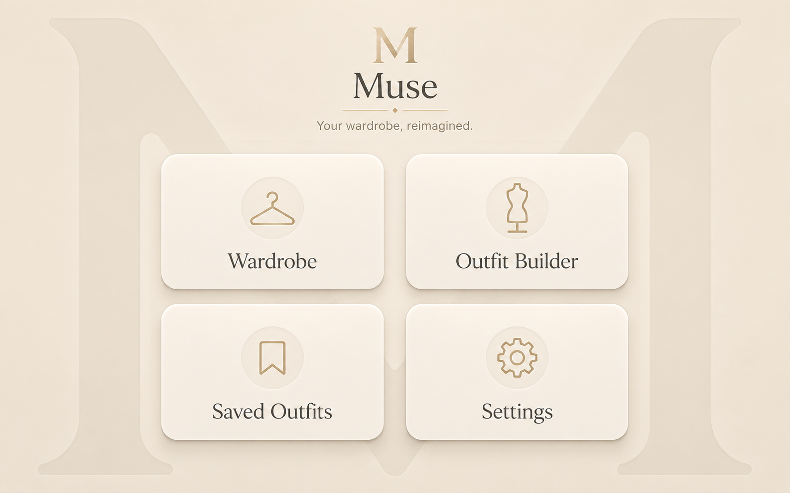

# Home Screen

## Purpose

The Home screen is the primary entry point into Muse.

Its purpose is to let the user immediately choose one of the four main product areas:

- Wardrobe
- Outfit Builder
- Saved Outfits
- Settings

The screen must feel simple, premium, calm, and instantly understandable.

---

## Approved Visual Reference



This mockup is the official visual reference for the Home screen.

---

## Screen Summary

The Home screen can be explained in one sentence:

> Choose what you want to do in Muse.

No additional information, widgets, statistics, recommendations, or secondary menus should distract from this purpose.

---

## Layout

The screen uses three main visual layers:

1. Muse identity and tagline
2. Four primary navigation cards
3. Large decorative background `M`

The layout is centered and designed for a landscape touchscreen at approximately `1280 × 800`.

---

## Background

The Home screen uses:

- A warm ivory background
- A very large, low-contrast `M`
- Soft beige and champagne tones
- No dark surfaces
- No visually aggressive gradients

The background `M` must remain visible but subtle.

It is decorative and must never interfere with readability or interaction.

---

## Brand Area

The upper central area contains:

- A golden `M`
- The Muse wordmark
- A thin champagne divider
- A central diamond
- The tagline:

```text
Your wardrobe, reimagined.
```

The brand area must remain visually balanced and must not consume too much vertical space.

It introduces the product without delaying access to the main actions.

---

## Primary Navigation Cards

The Home screen contains four large cards arranged in a two-by-two grid.

### Card 1: Wardrobe

Purpose:

- Open the clothing library
- Browse garments
- Access clothing details
- Add new garments

Visual identity:

- Hanger icon
- Label: `Wardrobe`

---

### Card 2: Outfit Builder

Purpose:

- Open the main outfit composition interface
- Build an outfit using the Muse silhouette
- Select and combine garments

Visual identity:

- Muse silhouette or mannequin icon
- Label: `Outfit Builder`

---

### Card 3: Saved Outfits

Purpose:

- Browse previously saved outfits
- Open an outfit in Outfit Builder
- Preview saved combinations

Visual identity:

- Bookmark or saved-item icon
- Label: `Saved Outfits`

---

### Card 4: Settings

Purpose:

- Configure the device
- Manage connectivity
- Manage display, data, and system settings
- Access information about Muse

Visual identity:

- Settings gear icon
- Label: `Settings`

---

## Card Design

Each primary card uses:

- Warm white or ivory surface
- Large rounded corners
- Thin beige border
- Soft warm shadow
- Champagne icon
- Circular icon background
- Large Playfair Display label
- Generous spacing
- Large touch area

The four cards must use identical dimensions and visual weight.

No card should appear more important than another.

---

## Interaction

When a card is pressed:

1. The card slightly reduces in scale.
2. The shadow becomes softer.
3. The selected card may receive a subtle champagne highlight.
4. Muse transitions to the selected page.

The interaction must feel immediate and smooth.

Recommended animation duration:

```text
180 to 240 ms
```

The transition must not use exaggerated movement.

---

## Navigation

The Home screen is the navigation root of Muse.

It does not need:

- A Back button
- A bottom navigation bar
- A side navigation menu
- Hidden navigation
- Secondary actions

Every major product section remains directly accessible from this screen.

---

## Touch Rules

- Every card must be easy to press with one finger.
- Cards must remain clearly separated.
- Touch targets must not overlap.
- Text must not be required for precise targeting.
- Icons and labels must both be inside the interactive area.
- No action may depend on hover.

---

## Responsive Behavior

The target orientation is landscape.

At the target Raspberry Pi resolution:

- The two-by-two grid remains visible without scrolling.
- The brand area remains centered.
- The cards remain large and comfortable.
- The background `M` remains correctly positioned.

On smaller development windows:

- Cards may reduce slightly in size.
- The grid should remain two columns where practical.
- Vertical scrolling may be used only as a fallback.

Portrait mode is not part of the MVP.

---

## Loading State

While the Home screen is loading:

- Preserve the background and main layout.
- Display subtle card skeletons if necessary.
- Avoid full-screen spinners.
- Do not display technical startup information.

The page should appear quickly after the Splash Screen.

---

## Error State

The Home screen should remain available even if one secondary service is unavailable.

Examples:

- Internet unavailable
- Update service unavailable
- Phone upload unavailable

Core navigation must continue to work.

If the local backend is unavailable:

- Display a clear recovery message.
- Offer a retry action.
- Keep the Muse visual identity visible.
- Do not expose the browser or operating system.

---

## Accessibility

The Home screen must provide:

- Large touch targets
- Readable text
- Strong enough contrast
- Visible keyboard focus states
- Support for reduced motion
- Logical tab order during development
- Labels accessible to screen readers where supported

Suggested accessible labels:

```text
Open Wardrobe
Open Outfit Builder
Open Saved Outfits
Open Settings
```

---

## Forbidden Elements

Do not add the following to the Home screen during the MVP:

- Weather
- Calendar
- Notifications
- Recommendations
- Recent activity
- User accounts
- Social features
- Search
- Clothing statistics
- Multiple navigation bars
- Advertising
- Retail content

These additions would weaken the clarity of the screen.

---

## Implementation Guidance

The Home screen should be implemented using reusable components.

Suggested structure:

```text
HomePage
├── BrandHeader
├── HomeActionGrid
│   ├── HomeActionCard
│   ├── HomeActionCard
│   ├── HomeActionCard
│   └── HomeActionCard
└── BackgroundMonogram
```

Navigation destinations:

```text
Wardrobe       → /wardrobe
Outfit Builder → /outfit-builder
Saved Outfits  → /saved-outfits
Settings       → /settings
```

The exact routing implementation may vary, but the user-facing behavior must remain identical.

---

## Definition of Done

The Home screen is complete when:

- The layout matches the approved mockup.
- The four primary cards are visible without scrolling.
- All cards navigate correctly.
- The background `M` is subtle and correctly positioned.
- Typography matches the Muse design system.
- Cards are comfortable to use on touchscreen.
- Press feedback is smooth and consistent.
- The page works without Internet access.
- Keyboard focus and reduced motion are supported.
- No unnecessary interface elements have been added.