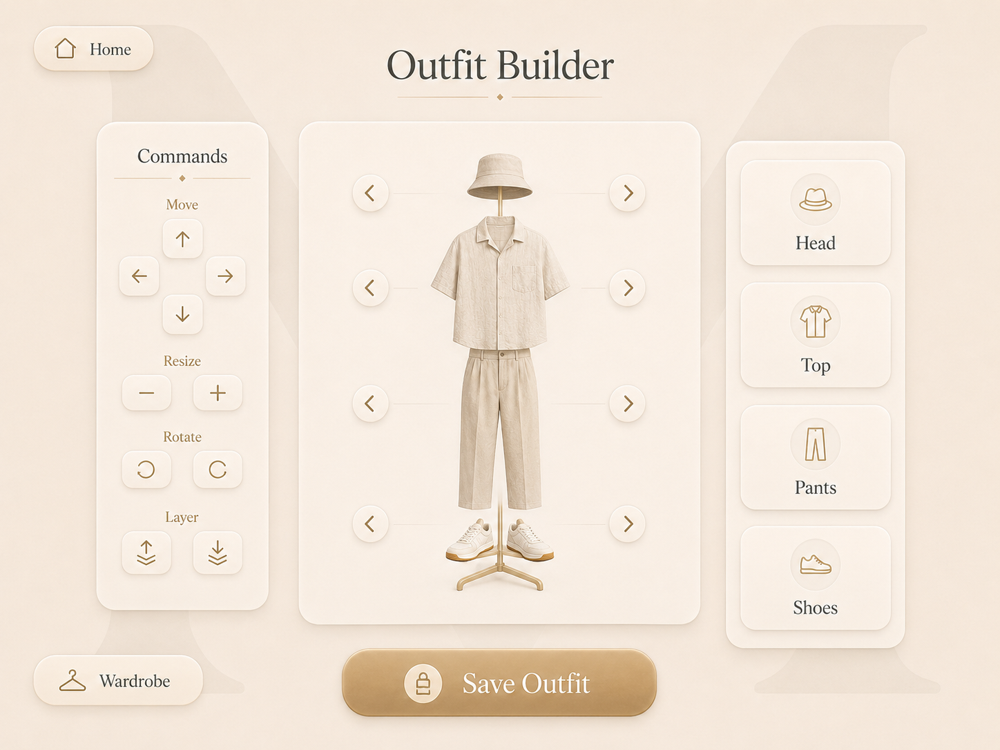

# Outfit Builder Screen

## Purpose

The Outfit Builder is the central creative workspace of Muse.

It allows the user to combine garments from the local wardrobe, preview them together on the Muse silhouette, adjust their placement when necessary, and save the completed combination as an outfit.

---

## Approved Visual Reference



This mockup is the official visual reference for the Outfit Builder screen.

---

## Screen Summary

The Outfit Builder can be explained in one sentence:

> Combine garments and create a complete outfit.

This screen is the functional heart of Muse.

It must remain visual, intuitive, touch-friendly, and understandable without instructions.

---

## Header

The upper section contains:

- A `Home` button in the upper-left corner
- The page title `Outfit Builder` centered at the top
- A subtle champagne divider beneath the title

### Home Button

The Home button returns to the Home screen.

If the current outfit contains unsaved changes, Muse must display a confirmation dialog before leaving.

Suggested options:

```text
Keep editing
Keep draft and leave
Discard draft and leave
```

---

## Main Layout

The screen is divided into three primary zones:

1. Commands panel on the left
2. Muse silhouette workspace in the center
3. Garment category controls on the right

Additional contextual actions appear beneath the main workspace.

The central silhouette remains the visual focus of the screen.

---

## Muse Silhouette

The central panel contains the Muse silhouette.

The silhouette must be:

- Minimal
- Elegant
- Recognizable
- Non-photorealistic
- Visually consistent with the Muse identity
- Suitable for layering garment images

The silhouette should resemble a refined fashion mannequin rather than a realistic human body.

It provides stable visual zones for:

- Head
- Top
- Pants
- Shoes

The visible quick controls stay faithful to those four approved categories. The
MVP data model, Wardrobe handoff, and placement renderer also support these
zones when an imported garment requires them:

- Neck
- Full body
- Accessory

Garment category describes what the item is; body zone describes its starting
placement. These are separate fields. The additional values do not add more
permanent panels or redesign the approved screen.

---

## Garment Zones

The four visible body-zone controls identify the current active or topmost
garment for that zone. They do not enforce one garment per zone. Several
distinct garments may overlap in the same zone, which supports combinations
such as a top and outerwear. The same clothing item may appear only once in a
draft; selecting it again activates the existing placement.

Initial zones:

```text
Head
Top
Pants
Shoes
```

Each zone contains:

- Previous garment arrow
- Current garment preview
- Next garment arrow

The arrows cycle only through garments whose effective default body zone matches
the corresponding control.

Example:

```text
Head arrows  → Hats and compatible head items
Top arrows   → Shirts, sweaters, jackets, and compatible tops
Pants arrows → Trousers, skirts, and compatible lower-body items
Shoes arrows → Shoes only
```

The user must never cycle into an incompatible body zone. This rule does not
collapse garment category and body zone into one field.

---

## Previous and Next Controls

Each garment zone includes visible left and right arrows.

### Previous

Selects the previous compatible garment in the current category.

### Next

Selects the next compatible garment in the current category.

### Behavior

When an arrow is pressed:

1. Muse selects the next or previous compatible garment.
2. The new garment appears smoothly.
3. A new arrow-cycle replacement inherits the current placement's transform and
   layer. If the selected item is already present elsewhere in the draft, its
   existing placement is preserved and activated. A new addition to an empty
   zone starts from the body's default transform and category-based layer.
4. The outfit becomes unsaved.
5. The currently active garment becomes selectable for command adjustments.

Cycling replaces the currently active or topmost placement for that zone. It
does not clear other overlapping placements in the zone or reset the rest of
the outfit.

The transition should feel immediate and smooth.

Recommended animation duration:

```text
180 to 260 ms
```

Swipe interaction may also be supported, but visible arrows must remain available.

---

## Empty Garment State

A body zone may contain no selected garment.

When empty:

- Keep the Muse silhouette visible
- Display no broken image
- Keep the previous and next controls available when compatible garments exist
- Allow category selection from the right panel

An optional neutral placeholder may indicate the empty zone.

The user must not be forced to select an item for every category.

---

## Category Controls

The right panel contains large rectangular category cards.

Initial categories:

- Head
- Top
- Pants
- Shoes

Each card contains:

- Category icon
- Category name
- Large touch area
- Muse card styling

---

## Opening a Category

When the user presses a category card:

1. Muse opens the in-place garment picker for that body zone.
2. Only compatible garments are displayed.
3. The current Outfit Builder state remains preserved.
4. The user selects one garment.
5. The picker closes and the selected garment appears in the correct body zone.

Example:

```text
Press Head
    ↓
Open Choose Head picker
    ↓
Select hat
    ↓
Close picker
    ↓
Hat appears in Head zone
```

The implemented selection view is a modal grid that follows the established
Wardrobe visual language. Wardrobe and Clothing Details can also hand a garment
to `/outfit-builder` by identifier without creating a second editor draft.

---

## State Preservation During Category Selection

Opening a category must preserve:

- All currently selected garments
- Garment transformations
- Layer order
- Unsaved state
- Outfit name when already entered
- Current command selection
- Origin screen context

Selecting another garment must not reset the rest of the outfit.

---

## Commands Panel

The left panel contains manual garment adjustment controls.

The commands are secondary tools.

Most garments should appear in a reasonable default position automatically.

The command panel exists when manual refinement is needed.

---

## Active Garment

Commands apply only to the currently selected garment.

The active garment may be selected by:

- Touching it directly on the silhouette
- Selecting its body zone
- Changing it with a previous or next arrow
- Selecting it from a category grid

The active garment should receive a subtle selection indicator.

The indicator must not visually damage the outfit preview.

---

## Move Controls

Move controls use four directional buttons:

```text
Up
Left
Right
Down
```

Each press moves the active garment by a small predictable amount.

Press-and-hold may repeat movement gradually.

Movement must remain constrained to the visible workspace.

The garment must not become permanently lost outside the screen.

---

## Resize Controls

Resize controls contain:

```text
Decrease size
Increase size
```

The controls adjust the active garment proportionally by default.

The garment must preserve its aspect ratio unless an advanced adjustment mode is intentionally introduced later.

Minimum and maximum limits must prevent unusable sizes.

---

## Rotate Controls

Rotate controls contain:

```text
Rotate left
Rotate right
```

Each press rotates the active garment by a small fixed angle.

Recommended step:

```text
5 degrees
```

Rotation must remain smooth and reversible.

---

## Layer Controls

Layer controls allow the active garment to move:

```text
Forward
Backward
```

Layer controls are useful when garments overlap.

Examples:

- Jacket above shirt
- Scarf above top
- Shoes above trousers where appropriate

Muse must prevent invalid or confusing layer states where practical.

Default layer ordering should follow garment type.

---

## Automatic Placement

When a garment is added, Muse automatically assigns:

- Body zone
- Default position
- Default size
- Default rotation
- Default layer

Automatic placement must provide a usable starting point.

The user should not need to manually position every garment from zero.

Manual commands refine the result when necessary.

---

## Garment Transformation Data

Each garment placed in an outfit stores:

- Position X
- Position Y
- Scale
- Rotation
- Layer index
- Body zone

These values belong to the outfit instance.

Changing a garment inside one outfit must not modify its placement inside every other saved outfit.

### Cross-Stack Transform Contract

The browser workspace and local preview renderer share a logical `640 × 800`
coordinate system:

- `position_x` and `position_y` are the garment center, measured from the
  top-left and clamped to `[0, 1]`.
- `scale` is one proportional value, clamped to `[0.1, 4]`; image aspect ratio
  is always preserved.
- `rotation` is clamped to `[-180, 180]` and positive values rotate clockwise
  around the garment center.
- `layer_index` is a unique integer from `0` through `10000`; lower values are
  behind higher values.
- The API accepts at most 250 placements in one outfit.

An unrotated garment width is:

```text
640 × body-zone base width × scale
```

The base-width fractions are:

| Body zone  | Fraction |
| ---------- | -------- |
| Head       | `0.28`   |
| Neck       | `0.34`   |
| Upper body | `0.50`   |
| Full body  | `0.56`   |
| Lower body | `0.42`   |
| Feet       | `0.40`   |
| Accessory  | `0.30`   |

The renderer then derives height from the selected image's aspect ratio. This
contract makes saved placements independent of CSS layout and keeps browser and
backend preview geometry aligned.

---

## Wardrobe Return Button

A contextual `Wardrobe` button may appear in the lower-left corner.

It appears only when Outfit Builder was opened from:

- Wardrobe
- Clothing Details
- A Wardrobe selection flow

It does not appear when Outfit Builder was opened directly from Home.

### Behavior

When pressed:

- Return to the exact previous Wardrobe context
- Preserve the current unsaved outfit temporarily
- Preserve selected garments and transformations
- Preserve the previously selected Wardrobe category and garment

The user must be able to return to Outfit Builder without losing progress.

---

## Save Outfit Button

The large rectangular `Save Outfit` button appears beneath the central workspace.

It is the primary action on this screen.

When pressed:

1. Muse validates the current outfit.
2. The user enters or confirms an outfit name.
3. Muse saves all garments and transformations.
4. A local preview image is generated before database ownership is committed.
5. The saved state is confirmed.

---

## Outfit Naming

When saving a new outfit, Muse asks for a name.

The name may be entered using:

- On-screen keyboard
- Connected physical keyboard
- Future phone-based input

Suggested default name:

```text
Look 01
```

The user may replace it with a custom name.

Examples:

```text
Casual Monday
Dinner Outfit
Summer Look
Black and Beige
```

---

## Duplicate Scope

The current MVP prevents accidental duplicate garment additions inside one
draft: selecting an already placed clothing item activates that placement. It
does not compare a new save with every persisted outfit. Exact duplicate-outfit
detection is an optional extension and is not a P5 completion requirement.

`Save as New Outfit` is an explicit user action and may intentionally create a
similar or identical saved composition.

---

## Saved State

After a successful save:

- Display a clear confirmation
- Keep the outfit visible
- Mark the current composition as saved
- Store the outfit name and preview
- Make it immediately available in Saved Outfits

If the user modifies anything afterward:

```text
Saved → Unsaved changes
```

The Save Outfit control becomes active again.

---

## Editing an Existing Outfit

When an outfit is opened from Saved Outfits:

- Load all garments
- Load all transformations
- Load all layers
- Load the outfit name
- Mark the composition as saved

After a modification, the user may:

```text
Update Outfit
Save as New Outfit
Cancel Changes
```

Deleting an existing outfit is available through the options menu and requires
confirmation. It soft-deletes the outfit record.

Deletion must not delete the clothing items themselves.

If a saved outfit references clothing that was deleted later, the outfit still
loads the retained reference and media fallback with a visible deleted-item
state. The deleted garment cannot be newly introduced into another outfit.

---

## Outfit Preview

Muse generates a deterministic preview image locally when an outfit is created
or its placements change. This is a backend Pillow render, not a browser
screenshot.

The preview should show:

- Muse silhouette
- Selected garments
- Current transformations
- Current layer order
- Clean neutral background

The preview is used in the Saved Outfits screen.

The renderer uses the same logical `640 × 800` transform contract as the
browser and emits a fixed `600 × 750` lossless WebP. It draws the neutral Muse
mannequin, sorts ascending layers from back to front, and tries each garment's
cutout, normalized, then original media. If all candidates for one garment fail
bounded decoding, that garment receives a neutral placeholder while the rest of
the preview still renders.

Every preview receives a unique immutable name. Muse renders it under the
private preview staging root, writes a durable recovery manifest, and atomically
promotes it before a short database transaction records ownership. Failure to
render, promote, or update the database leaves the previous outfit and preview
unchanged; a failed create leaves no outfit row. Name-only and
unchanged-placement edits reuse the registered preview.

After a successful placement update, Muse removes the superseded unregistered
file. Startup reconciliation retries deferred cleanup, preserves every preview
owned by an active or soft-deleted outfit row, and removes only known orphaned
generated previews. Soft deletion retains its registered preview until an
explicit permanent-retention policy is implemented.

Preview generation requires no Internet access, hosted renderer, paid API, or
downloaded model.

---

## Editor Session and Recovery

One reducer-backed provider owns the current draft for new and existing
outfits. It stores:

- mode and saved outfit identifier;
- outfit name and ordered placements;
- active garment;
- allowed origin return path; and
- the last saved baseline used for dirty-state comparison and restore.

TanStack Query continues to own API state; it is not a second editor store. The
draft is encoded into a versioned, validated, 512 KiB-bounded
`sessionStorage` record. A reload recovers valid work, while corrupt, oversized,
or unsupported data is removed safely. A failed save leaves the draft intact.

The Builder prompts before a direct departure with unsaved changes. Its
temporary Wardrobe route is allowed so garment selection can continue without
discarding the draft; the session record remains the recovery boundary while
the Builder route is not mounted. Loading another saved outfit does not silently
replace a dirty draft.

---

## Loading State

While garment data is loading:

- Keep the silhouette visible
- Preserve the three-panel layout
- Display subtle placeholders
- Keep Home available
- Avoid blocking the whole screen unnecessarily

---

## Error State

If a garment fails to load:

- Keep the remaining outfit visible
- Display a neutral placeholder in the affected zone
- Offer Retry
- Offer Select Another Garment

If saving fails:

- Preserve the complete current outfit
- Display a clear error
- Offer Retry
- Never discard the user's work

Suggested message:

```text
Muse could not save this outfit.
Your current outfit has been preserved.
```

---

## Offline Behavior

All core Outfit Builder functionality must work without Internet access.

Offline functionality includes:

- Selecting garments
- Cycling through garments
- Opening local category views
- Moving garments
- Resizing garments
- Rotating garments
- Changing layers
- Saving outfits
- Loading saved outfits
- Generating previews

Internet access must never be required for outfit creation.

---

## Touch Interaction

The screen must support:

- Large category cards
- Large previous and next arrows
- Large command buttons
- Direct garment selection
- Clear pressed states
- No hover-dependent actions
- Comfortable spacing

Commands requiring repeated input may support press-and-hold.

Accidental touches must not delete or permanently modify data.

---

## Visual Rules

The Outfit Builder must use:

- Warm ivory background
- Large low-contrast background `M`
- Champagne accents
- Rounded ivory panels
- Soft warm shadows
- Dark primary text
- Consistent Playfair Display titles
- Consistent Inter interface text
- No dark theme
- No permanent bottom navigation
- No small mobile-style controls

The approved mockup and Muse design system are the visual sources of truth.

---

## Accessibility

The screen must provide:

- Large touch targets
- Visible active garment state
- Accessible labels for every command
- Keyboard alternatives during development
- Reduced-motion support
- Clear saved and unsaved states
- Visible focus indicators
- Predictable command behavior

Suggested accessible labels:

```text
Return to Home
Previous head garment
Next head garment
Previous top garment
Next top garment
Previous pants garment
Next pants garment
Previous shoes garment
Next shoes garment
Head
Top
Pants
Shoes
Move garment up
Move garment down
Move garment left
Move garment right
Decrease garment size
Increase garment size
Rotate garment left
Rotate garment right
Move garment forward
Move garment backward
Save outfit
Return to Wardrobe
```

---

## Responsive Behavior

Primary target:

```text
1280 × 800 landscape touchscreen
```

At the target resolution:

- Commands panel remains visible
- Silhouette remains large
- Category controls remain visible
- Save Outfit remains easy to reach
- No horizontal page scrolling occurs

On smaller development screens:

- Panels may reduce proportionally
- Vertical scrolling may be allowed
- The central workspace must remain usable
- Touch targets must not become too small

Portrait mode is outside the MVP scope.

---

## Performance

The Outfit Builder must remain smooth on Raspberry Pi hardware.

Targets:

- Immediate category response
- Smooth garment transitions
- Smooth transformation updates
- No visible full-page reload
- No network dependency
- Efficient local image rendering

Large garment images should use optimized processed versions while preserving originals separately.

Canvas pointer movement is frame-batched and updates only the local reducer; it
does not mutate the API during drag. Image candidates are held in a bounded
browser cache, and alpha-mask hit testing is generated at bounded dimensions.

On an Apple M4 development machine running Python 3.13.14, a 20-placement
synthetic preview had a `0.2334 s` median and `0.2383 s` maximum across five
warmed renders and produced a 40,034-byte WebP. This confirms deterministic
development behavior only. Raspberry Pi render latency, browser smoothness,
memory, temperature, and throttling remain unmeasured until the target-hardware
procedure is run.

---

## Implementation Guidance

Implemented component and state structure:

```text
App
└── QueryClientProvider
    └── OutfitBuilderProvider
        └── RouterProvider
            └── OutfitBuilderPage
                ├── PageHeader and contextual navigation
                ├── command controls
                ├── OutfitWorkspace (Canvas 2D and local silhouette asset)
                ├── visible Head, Top, Pants, and Shoes controls
                ├── in-place garment picker dialog
                ├── semantic layer list
                └── save, options, delete, and unsaved-change dialogs
```

Possible route:

```text
/outfit-builder
```

Validated navigation parameters:

```text
outfitId
garment
returnTo
preserveDraft
```

`preserveDraft=1` is accepted only as a local navigation marker for an explicit
Builder-originated Wardrobe round trip. Wardrobe, Clothing Details, and Add
Garment preserve it; ordinary Home-originated Wardrobe navigation omits it so a
clean retained editor state cannot be mistaken for the next new outfit.

---

## Manual Mac Cutout Verification

1. Import a garment with a transparent source or another source for which the
   local optional cutout processing completes successfully.
2. Open Outfit Builder and add that garment.
3. Before the first save, confirm that the garment is displayed without its
   background.
4. Move, resize, rotate, and reorder the garment, then save the outfit.
5. Reopen the saved outfit and confirm that the cutout, position, scale,
   rotation, and layer order are unchanged.

---

## Definition of Done

The P5 Outfit Builder implementation is complete when:

- The layout matches the approved mockup.
- The Muse silhouette renders correctly.
- Each category cycles only through compatible garments.
- Category cards open filtered garment selection views.
- Selecting a garment preserves the rest of the outfit.
- Manual movement works.
- Resize works.
- Rotation works.
- Layer controls work.
- Automatic placement provides a usable default.
- The Wardrobe return button appears only in the correct context.
- Saving stores garments and transformations.
- Re-selecting the same garment does not duplicate its placement.
- Saved outfits can be reopened and edited.
- Preview images are generated and recovered locally.
- The versioned editor draft survives reload and save failures.
- The complete workflow works without Internet access.

These development requirements are implemented. Raspberry Pi smoothness,
thermal behavior, and interruption recovery remain release-validation gates;
they are not claimed by this milestone. Exact duplicate-outfit detection is an
optional extension.
