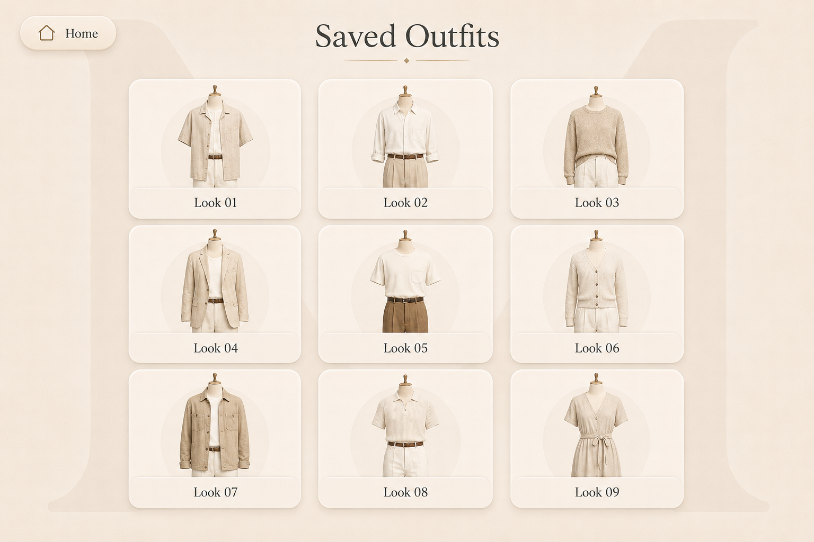

# Saved Outfits Screen

## Purpose

The Saved Outfits screen allows the user to browse every outfit previously created and stored in Muse.

Its purpose is to provide a visual history of saved combinations and allow the user to reopen an outfit directly in Outfit Builder.

---

## Approved Visual Reference



This mockup is the official visual reference for the Saved Outfits screen.

---

## Screen Summary

The Saved Outfits screen can be explained in one sentence:

> Browse and reopen outfits you have already created.

The screen must remain visual, calm, and simple.

It must not become a complex outfit-management dashboard.

---

## Header

The upper section contains:

- A `Home` button in the upper-left corner
- The page title `Saved Outfits` centered at the top
- A subtle champagne divider beneath the title

### Home Button

The Home button returns directly to the Home screen.

Opening Home must not modify or delete any saved outfit.

---

## Main Layout

Saved outfits are displayed as large visual cards in a vertical list.

Each card contains:

- Outfit preview
- Muse silhouette
- Saved garment combination
- Outfit number or name
- Large touch area

The newest outfit appears first.

The oldest outfit appears last.

Recommended default order:

```text
Newest first
```

The list may scroll vertically when necessary.

---

## Outfit Cards

Each saved outfit uses a large rounded card.

Cards contain enough space to display the complete outfit clearly.

The card design uses:

- Warm ivory surface
- Large rounded corners
- Thin beige border
- Soft warm shadow
- Champagne details
- Large outfit preview
- Minimal text
- Comfortable spacing

Cards must remain visually consistent with the rest of Muse.

---

## Outfit Preview

The preview shows:

- Muse silhouette
- Every selected garment
- Saved position
- Saved scale
- Saved rotation
- Saved layer order

The preview must represent the saved outfit accurately.

It must not regenerate a different visual result each time the page opens.

Preview images are created locally when the outfit is saved.

---

## Outfit Identification

Every outfit has:

- Stable internal identifier
- Creation timestamp
- Optional user-defined name
- Display order

If the user does not provide a custom name, Muse may assign a default name.

Examples:

```text
Outfit 01
Outfit 02
Outfit 03
```

The number is based on creation order.

A custom name may replace or accompany the number.

Examples:

```text
Casual Monday
Dinner Look
Summer Outfit
Black and Beige
```

The approved mockup uses visual numbering to show the outfit sequence.

---

## Ordering

Saved outfits are ordered automatically.

Default behavior:

```text
Most recently created or updated outfit first
Oldest outfit last
```

The MVP does not require:

- Manual sorting
- Advanced filtering
- Categories
- Search
- Folders
- Tags

These features may be considered later if users store significantly larger outfit collections.

---

## Primary Tap Interaction

A normal tap on an outfit card opens that outfit in Outfit Builder.

When pressed:

1. Muse loads the selected outfit.
2. Every garment is restored.
3. Every transformation is restored.
4. Layer order is restored.
5. Outfit name is restored.
6. Outfit Builder marks the outfit as saved.
7. The user may modify or update it.

Navigation:

```text
Saved Outfits
    ↓
Select Outfit
    ↓
Outfit Builder
```

---

## Long-Press Preview

A long press may open a larger visual preview.

The enlarged preview contains:

- Full outfit image
- Outfit name
- Optional creation information
- Close action
- Open in Outfit Builder action

Long press is an optional convenience.

It must not be the only way to access important functionality.

A visible alternative may be added later if testing shows that long press is unclear.

---

## Fullscreen Preview

When an outfit preview is opened fullscreen:

- The outfit fills most of the display
- The Muse silhouette remains visible
- Garments remain in their saved positions
- The background remains consistent with Muse
- A visible close or reduce control is provided
- An `Open in Outfit Builder` button may be displayed

Closing the preview returns to the same list position.

---

## Editing an Outfit

Editing occurs inside Outfit Builder.

The Saved Outfits screen does not contain complex editing controls.

After opening an outfit in Outfit Builder, the user may:

- Change garments
- Change garment positions
- Change size
- Change rotation
- Change layers
- Update the outfit
- Save as a new outfit
- Delete the outfit

This keeps Saved Outfits focused on browsing rather than editing.

---

## Deleting an Outfit

Deletion should primarily occur from Outfit Builder after the outfit is opened.

An optional delete action may later be added to:

- Fullscreen preview
- Context menu
- Long-press panel

Before deletion, Muse must display a confirmation dialog.

Suggested message:

```text
Delete this outfit?

The outfit will be removed from Saved Outfits.
Your clothing items will remain in Wardrobe.
```

Deleting an outfit must never delete its garments.

---

## Updating an Outfit

When a saved outfit is modified in Outfit Builder, the user may choose:

```text
Update Outfit
Save as New Outfit
Cancel Changes
```

### Update Outfit

Replaces the existing saved configuration.

### Save as New Outfit

Creates another outfit while preserving the original.

### Cancel Changes

Returns to the previously saved version.

After a successful update, the outfit moves to the top of Saved Outfits because it is now the most recently updated item.

---

## Empty State

When no outfits have been saved, the page displays:

```text
No saved outfits yet.

Create your first look in Outfit Builder.
```

The empty state should include a large rectangular button:

```text
Open Outfit Builder
```

The page must still display:

- Home button
- Saved Outfits title
- Background `M`
- Muse visual identity

The empty state must feel intentional rather than broken.

---

## Loading State

While outfits are loading:

- Preserve the page structure
- Display large card skeletons
- Keep Home accessible
- Avoid full-screen spinners
- Avoid abrupt layout movement

The cards should appear progressively when ready.

---

## Error State

If saved outfits cannot be loaded:

- Display a clear message
- Offer Retry
- Keep Home accessible
- Preserve the Muse visual identity
- Do not display raw technical errors

Suggested message:

```text
Muse could not load your saved outfits.
Please try again.
```

If one preview image is missing:

- Keep the outfit card available
- Display a neutral preview placeholder
- Allow the outfit to open in Outfit Builder
- Regenerate the preview when possible

---

## State Preservation

Muse must preserve:

- Current vertical scroll position
- Selected outfit
- Open fullscreen preview
- Origin screen
- Current list order

When returning from Outfit Builder without deleting the outfit, the user should return to approximately the same location in the list.

---

## Offline Behavior

All Saved Outfits functionality must work without Internet access.

Offline functionality includes:

- Loading outfit cards
- Displaying previews
- Opening Outfit Builder
- Updating outfits
- Deleting outfits
- Regenerating previews
- Preserving list order

No cloud service is required for the MVP.

---

## Touch Interaction

The screen must support:

- Large outfit cards
- Comfortable vertical scrolling
- Clear pressed feedback
- Optional long press
- Large fullscreen controls
- No hover-dependent actions

The user must be able to open an outfit without precise pointer placement.

---

## Visual Rules

The Saved Outfits screen must use:

- Warm ivory background
- Large low-contrast background `M`
- Champagne accents
- Rounded outfit cards
- Soft warm shadows
- Playfair Display title
- Inter interface text
- Dark readable text
- No bottom navigation
- No dark theme
- No excessive metadata
- No visually crowded sorting toolbar

The approved mockup and Muse design system are the visual sources of truth.

---

## Accessibility

The screen must provide:

- Large touch targets
- Visible keyboard focus states
- Accessible card labels
- Reduced-motion support
- Swipe-independent navigation
- Clear empty and error states
- Confirmation before deletion

Suggested accessible labels:

```text
Return to Home
Open Outfit 01
Open Outfit 02
Preview Outfit 01
Open outfit in Outfit Builder
Close outfit preview
```

If custom outfit names exist, accessible labels should use those names.

Example:

```text
Open Casual Monday in Outfit Builder
```

---

## Responsive Behavior

Primary target:

```text
1280 × 800 landscape touchscreen
```

At the target resolution:

- At least two large outfit cards should remain comfortably visible
- Cards should use most of the available width
- Outfit previews should remain clear
- Vertical scrolling should feel smooth
- No horizontal page scrolling should occur

On smaller development screens:

- Cards may reduce proportionally
- Vertical scrolling remains available
- Touch targets must remain large

Portrait mode is outside the MVP scope.

---

## Performance

The Saved Outfits screen must remain smooth with a reasonable collection of locally stored outfits.

Recommended behavior:

- Load optimized preview images
- Lazy-load previews below the visible area
- Preserve original outfit data separately
- Avoid re-rendering every outfit while scrolling
- Avoid regenerating previews every time the page opens

A missing preview may be regenerated in the background without blocking the complete page.

---

## Implementation Guidance

Suggested component structure:

```text
SavedOutfitsPage
├── PageHeader
│   ├── HomeButton
│   └── PageTitle
├── SavedOutfitList
│   └── SavedOutfitCard
│       ├── OutfitPreview
│       ├── OutfitIdentifier
│       └── PressInteraction
├── OutfitFullscreenPreview
├── EmptySavedOutfitsState
├── ErrorState
└── BackgroundMonogram
```

Possible route:

```text
/saved-outfits
```

Opening an outfit:

```text
/saved-outfits
    ↓
/outfit-builder?outfitId={id}
```

The exact navigation implementation may vary, but all saved outfit data must be restored correctly.

---

## Data Requirements

Each saved outfit should contain:

```text
id
name
created_at
updated_at
preview_image_path
garment_items
transformations
layer_order
```

Each garment item within the outfit should contain:

```text
clothing_item_id
body_zone
position_x
position_y
scale
rotation
layer_index
```

The Saved Outfits screen reads preview and summary data.

Outfit Builder loads the complete configuration.

---

## Definition of Done

The Saved Outfits screen is complete when:

- The layout matches the approved mockup.
- Saved outfits appear newest first.
- Every card shows the correct outfit preview.
- A tap opens the correct outfit in Outfit Builder.
- All garments and transformations are restored.
- Long-press or fullscreen preview works if included.
- Returning from Outfit Builder preserves the list position.
- Updating an outfit refreshes its preview.
- Deleting an outfit does not delete clothing items.
- The empty state links to Outfit Builder.
- Missing preview images are handled safely.
- The complete screen works without Internet access.
- Scrolling remains smooth on Raspberry Pi.