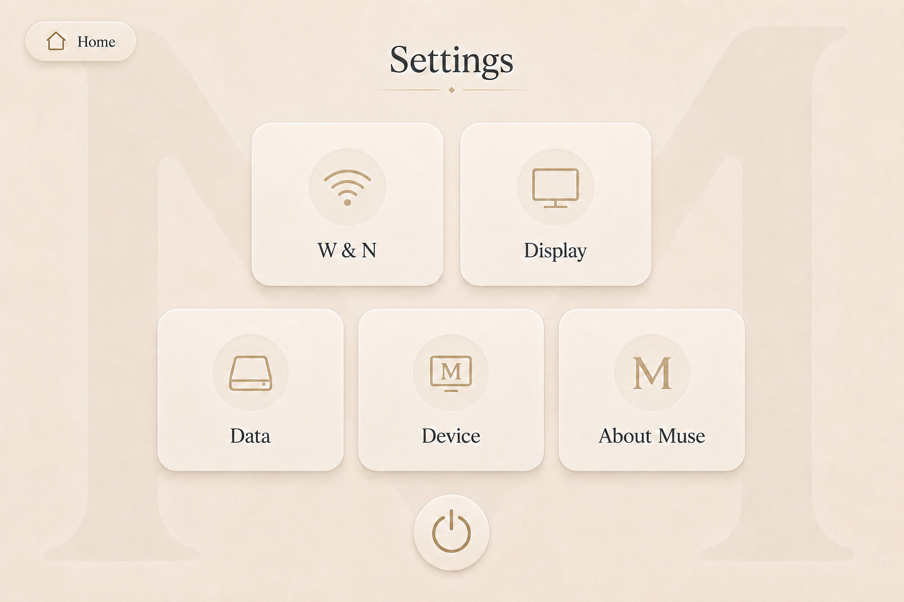

# Settings Screen

## Purpose

The Settings screen allows the user to manage the Muse device and its local application configuration.

Its purpose is to provide direct access to connectivity, display, data, device, system information, and power controls without exposing the underlying operating system.

---

## Approved Visual Reference



This mockup is the official visual reference for the Settings screen.

---

## Screen Summary

The Settings screen can be explained in one sentence:

> Configure the Muse device and manage its local data.

The screen must remain simple, safe, and understandable for a non-technical user.

---

## Header

The upper section contains:

- A `Home` button in the upper-left corner
- The page title `Settings` centered at the top
- A subtle champagne divider beneath the title

### Home Button

The Home button returns directly to the Home screen.

Leaving Settings must preserve any setting that has already been successfully applied.

If a setting contains unsaved changes, Muse must ask the user to:

```text
Save Changes
Discard Changes
Cancel
```

---

## Main Layout

The Settings screen contains five large navigation cards arranged across two rows.

### First Row

- `W & N`
- `Display`

### Second Row

- `Data`
- `Device`
- `About Muse`

A round Power button is centered beneath the cards.

The layout must remain balanced and spacious at the target resolution.

---

## W & N

`W & N` represents Wi-Fi and Network settings.

The label must appear exactly as:

```text
W & N
```

It must not appear as:

```text
WNN
```

The card uses a Wi-Fi icon and opens safe Wi-Fi and network status.

### Purpose

The W & N section allows the user to:

- View the current network status
- View the device hostname and preferred local address
- View the safely identified active interface when available
- View the Muse local network address
- Access the phone upload connection information
- Understand whether the restricted phone-upload listener is available
- Understand that core Muse features remain available without Internet

Searching for networks, handling Wi-Fi credentials, connecting, disconnecting,
and forgetting networks require a deployment-specific capability. They are not
presented as working controls unless the Raspberry Pi adapter reports that the
capability is genuinely available.

---

## Offline Status

Muse is offline-first.

The W & N screen must clearly distinguish:

```text
Connected
Local network only
Offline
Checking
Listener unavailable
Address unavailable
```

Internet access is optional for core Muse features.

When no Internet connection exists, the interface should explain:

```text
Muse is offline.

Your wardrobe, outfits, and local features remain available.
```

The absence of Internet must not be presented as a critical device failure.

---

## Wi-Fi Management Capability

Direct Wi-Fi credential management is not required for the completed software
MVP. Until a narrow Raspberry Pi adapter is installed and physically validated,
Muse reports that changing networks is completed during device setup. It must
not show a simulated connection flow or store Wi-Fi passwords in application
settings.

If this capability is activated in a later deployment, passwords must never be
returned by the API, logged, stored in the generic settings table, or remain
visible by default.

---

## Local Network Information

The W & N section may display:

- Device hostname
- Local IP address
- Local upload URL
- Restricted listener availability
- Active interface when safely available
- Optional Internet status as a secondary signal

Example:

```text
Device name: Muse
Local address: http://muse.local
```

Technical details must remain secondary and easy to understand.

---

## Display

The Display card opens visual and screen-related settings.

### Display Settings

The P6 software settings include:

- Interface brightness
- Automatic screen timeout
- Reduced motion
- Splash mode

Interface scale, text size, hardware backlight control, kiosk status, and touch
calibration are not exposed as working software controls in P6.

---

## Interface Dimming

The completed software MVP uses a large touch-friendly interface-dimming
slider. This is a visual overlay and is not described as physical backlight
control. Hardware brightness remains a separate capability for P7.

The current value should update immediately.

The interface should provide:

- Decrease control
- Increase control
- Slider
- Current percentage

Example:

```text
Interface brightness: 70%
```

The screen must never become completely invisible through an accidental setting.

Muse should enforce a safe minimum brightness value.

---

## Screen Timeout

The user may choose when the screen dims or sleeps.

Suggested values:

```text
Never
5 minutes
10 minutes
15 minutes
30 minutes
```

The default value should be appropriate for a household touchscreen device.

Touching the display should wake the interface immediately.

---

## Reduced Motion

Reduced Motion disables or simplifies non-essential animation.

When enabled:

- Splash animation becomes shorter
- Page transitions use simple fades
- Card movement is reduced
- Garment transitions remain functional but restrained

Essential feedback must remain visible.

---

## Data

The Data card opens local storage and wardrobe data management.

### Data Settings

The Data section may include:

- Storage usage
- Number of garments
- Number of saved outfits
- Export data
- Import data
- Create backup
- Restore backup
- Clear temporary files
- Delete all Muse data

---

## Storage Summary

Muse should display a simple local storage overview.

Example:

```text
Garments: 84
Saved Outfits: 19
Images: 1.8 GB
Available Storage: 42 GB
```

The interface must avoid unnecessary technical storage terminology.

---

## Export and Backup

Muse should support exporting local data for backup.

A backup may include:

- Garment information
- Original garment images
- Processed garment images
- Saved outfits
- Outfit transformations
- Outfit previews
- Application preferences

The user should be able to export the backup to supported local storage.

The backup format must be documented and versioned.

Backup creation uses a consistent SQLite snapshot and copies only registered
persistent media. The archive excludes temporary uploads, caches, logs,
environment files, nested backups, and operational phone-upload sessions. A
manifest records the format version, creation time, application version, entry
sizes, and checksums. Temporary archives are never listed as successful and the
final file is promoted atomically.

---

## Restore Backup

Before restoring data, Muse must explain whether the restore will:

- Add to existing data
- Replace existing data

The MVP should prefer a clear replace workflow unless safe merging is implemented.

Before replacing existing data:

1. Display a warning.
2. Explain what will be replaced.
3. Require explicit confirmation.
4. Recommend creating a current backup.

Restore is split into validation/staging and activation. Muse validates the
closed archive structure, checksums, version, SQLite integrity, migrations,
available space, path safety, and media ownership before staging anything.
Because the main application, phone listener, and worker share SQLite and local
media, activation occurs only while those processes are stopped. A staged
restore is described as pending, never as completed. The P7 supervisor contract
will coordinate activation on the physical device.

---

## Delete All Data

Deleting all Muse data is a destructive action.

It must never occur after one press.

Required confirmation flow:

1. Display a clear warning.
2. Explain that garments, images, and outfits will be removed.
3. Require a second confirmation.
4. Offer Cancel as the visually safer action.

Suggested message:

```text
Delete all Muse data?

This will permanently remove all garments, images, saved outfits, and local preferences from this device.
```

A typed confirmation may be required.

Exact completed-MVP phrase:

```text
Type DELETE ALL MUSE DATA to continue.
```

The completed MVP requires this typed confirmation in addition to both visual
confirmation steps. The backend never accepts a user-provided path and
preserves the application installation and required directory structure.

---

## Device

The Device card opens hardware and system controls related to the dedicated Muse device.

### Device Information

The Device section may display:

- Device name
- Muse application version
- Operating status
- Available storage
- Current date and time
- Device temperature
- Touchscreen status
- Backend service status
- Last successful backup
- Last software update

Technical information must be translated into understandable statuses.

Example:

```text
System status: Ready
Touchscreen: Connected
Storage: Available
```

Raw logs and terminal output must not appear in the standard user interface.

---

## Date and Time

Muse should normally use automatic date and time.

The Device section may allow:

- Automatic time
- Time zone selection
- Manual date and time fallback

The correct time is important for:

- Garment creation dates
- Outfit timestamps
- Backup history
- Update history

---

## Software Updates

Software update controls may appear inside Device.

The user may:

- View the installed version
- Check for updates
- Install an available update
- View the last update status

Updating requires Internet access.

Core Muse functionality must remain available when the device is offline.

### Update Safety

Before installation:

- Explain that Muse may restart
- Preserve user data
- Verify sufficient storage
- Avoid interrupting an active save operation

If an update fails:

- Keep the previous working version where possible
- Display a clear recovery message
- Do not expose the operating system

---

## Device Restart

A Restart action may appear inside Device.

Restart must require confirmation.

Suggested message:

```text
Restart Muse?

The device will be unavailable for a short moment.
```

Any unsaved application state must be protected before restarting.

---

## About Muse

The About Muse card opens product and project information.

### About Information

The section may contain:

- Muse logo
- Product name
- Tagline
- Application version
- Project description
- Creator information
- License information
- Open-source acknowledgements
- Privacy statement
- Repository information when appropriate

Suggested presentation:

```text
Muse

Your wardrobe, reimagined.
```

---

## Privacy Information

The About Muse section should clearly explain the local-first behavior.

Suggested statement:

```text
Muse stores your wardrobe, images, and outfits locally on your device.

Core features do not require a cloud account or permanent Internet connection.
```

The statement must accurately reflect the implemented product.

Muse must not claim that data is fully private if optional external services are later enabled without clearly explaining them.

---

## Version Information

The application version should use a clear format.

Example:

```text
Muse 0.1.0
```

Optional technical information may be placed behind a secondary `Technical Details` action.

The main About screen must remain simple.

---

## Power Button

A large round Power button is centered at the bottom of the Settings screen.

It is visually separate from the five navigation cards.

The button uses:

- Round shape
- Power icon
- Champagne styling by default
- Large touch area
- Clear pressed feedback

It must not shut down the device immediately.

---

## Power Menu

Pressing the Power button opens a confirmation panel.

Available actions may include:

```text
Sleep Display
Restart Muse
Restart Device
Shut Down
Cancel
```

### Sleep Display

Turns off or dims the display while keeping Muse running.

### Restart Muse

Requests an application restart only when a configured process-supervisor
capability exists.

### Restart Device

Restarts the Raspberry Pi only when the privileged deployment capability is
available and separately confirmed.

### Shut Down

Safely shuts down the Raspberry Pi only when the privileged deployment
capability is available and separately confirmed.

### Cancel

Closes the power menu without changing the device state.

---

## Capability and Shutdown Safety

P6 does not execute privileged restart or shutdown commands. Development and CI
show those actions as unavailable, and Raspberry Pi activation remains P7 work.
No generic command string, `shell=True`, broad sudo rule, or root web process is
permitted.

Before shutdown, Muse must:

1. Save all confirmed data.
2. Protect unsaved changes.
3. Stop local services safely.
4. Close the database correctly.
5. Display a shutdown message.
6. Prevent the user from unplugging the device too early where possible.

Suggested message:

```text
Muse is shutting down safely.

Please wait before disconnecting the power.
```

When shutdown is complete, the screen may display:

```text
Muse is now off.
```

---

## Settings Navigation

Each card opens a dedicated settings page or panel.

Suggested routes:

```text
/settings/network
/settings/display
/settings/data
/settings/device
/settings/about
```

The Back button inside each subsection returns to the main Settings screen.

The user must not be required to return to Home between settings sections.

---

## Setting Application

Settings should behave according to their type.

### Immediate Settings

These may apply as soon as they change:

- Brightness
- Reduced motion
- Screen timeout

### Confirmed Settings

These require an explicit confirmation:

- Wi-Fi connection
- Data restore
- Delete all data
- Software update
- Restart
- Shutdown

The interface must clearly communicate whether a change is already active.

---

## Loading State

While settings information is loading:

- Keep the main layout visible
- Display subtle placeholders inside cards
- Keep Home accessible when possible
- Avoid full-screen technical spinners

One unavailable setting must not block the entire Settings screen.

---

## Error State

When an operation fails:

- Explain what could not be completed
- Preserve the previous valid setting
- Offer Retry when useful
- Offer Cancel or Back
- Avoid exposing raw system errors

Example:

```text
Muse could not connect to this network.

Check the password and try again.
```

---

## Offline Behavior

Most Settings features must remain available offline.

Offline settings include:

- Display
- Data management
- Device information
- Local backup
- About Muse
- Power controls

Internet-dependent settings include:

- Checking for software updates
- Downloading updates
- Future online services

Internet-dependent controls should clearly explain why they are unavailable.

---

## Touch Interaction

The screen must support:

- Large navigation cards
- Large power control
- Comfortable sliders
- Large confirmation buttons
- On-screen keyboard where necessary
- No hover-dependent actions

Destructive controls must remain separated from normal settings.

---

## Visual Rules

The Settings screen must use:

- Warm ivory background
- Large low-contrast background `M`
- Champagne icons and accents
- Rounded ivory cards
- Soft warm shadows
- Playfair Display page title
- Inter interface labels
- Dark readable text
- Green only for successful states
- Red only for destructive actions or serious errors

Do not use:

- Dark theme
- Technical dashboards
- Terminal-like interfaces
- Small system menus
- Native Raspberry Pi desktop windows
- Permanent bottom navigation
- Dense configuration tables

The approved mockup and Muse design system are the visual sources of truth.

---

## Accessibility

The Settings screen must provide:

- Large touch targets
- Clear card labels
- Text alongside icons
- Visible focus states
- Reduced-motion control
- Readable status messages
- Confirmation before destructive actions
- Keyboard navigation during development
- Safe brightness limits
- Clear network state descriptions

Suggested accessible labels:

```text
Return to Home
Open Wi-Fi and Network settings
Open Display settings
Open Data settings
Open Device settings
Open About Muse
Open power options
```

---

## Responsive Behavior

Primary target:

```text
1280 × 800 landscape touchscreen
```

At the target resolution:

- All five cards remain visible without scrolling
- The Power button remains visible
- Cards remain large and comfortable
- The page remains visually balanced
- No horizontal scrolling occurs

On smaller development screens:

- Vertical scrolling may be enabled
- Cards may wrap while preserving their hierarchy
- Touch targets must remain large

Portrait mode is outside the MVP scope.

---

## Implementation Guidance

Suggested component structure:

```text
SettingsPage
├── PageHeader
│   ├── HomeButton
│   └── PageTitle
├── SettingsGrid
│   ├── SettingsCard
│   │   └── W & N
│   ├── SettingsCard
│   │   └── Display
│   ├── SettingsCard
│   │   └── Data
│   ├── SettingsCard
│   │   └── Device
│   └── SettingsCard
│       └── About Muse
├── PowerButton
├── PowerMenu
└── BackgroundMonogram
```

Suggested subsection components:

```text
NetworkSettingsPage
DisplaySettingsPage
DataSettingsPage
DeviceSettingsPage
AboutMusePage
```

---

## Definition of Done

The Settings screen is complete when:

- The layout matches the approved mockup.
- The label `W & N` is displayed correctly.
- All five cards open the correct section.
- Home navigation works.
- Display settings apply correctly.
- Network status is clearly displayed.
- Core offline behavior is explained correctly.
- Data backup and restore workflows protect user data.
- Destructive data actions require strong confirmation.
- Device status is understandable.
- About Muse displays accurate product information.
- The Power button opens a confirmation menu.
- Restart and shutdown protect unsaved data.
- No operating system interface becomes visible.
- The screen remains smooth and usable on Raspberry Pi.
