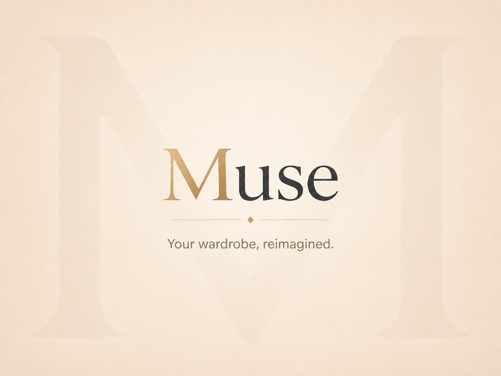

# Splash Screen

## Purpose

The Splash Screen introduces Muse and creates the first impression of the product before the Home screen appears.

It must feel calm, premium, deliberate, and visually connected to the rest of the Muse interface.

The Splash Screen is not a loading dashboard and must not display technical information, progress percentages, menus, or controls.

---

## Approved Visual Reference



This mockup represents the final state of the splash animation.

---

## Final Composition

The final frame contains:

- A warm ivory background
- A very large, low-contrast `M` watermark in the background
- The Muse wordmark centered on the screen
- A gold `M`
- Dark `use` letters using the same typeface and baseline
- A thin champagne divider with a central diamond
- The tagline:

> Your wardrobe, reimagined.

The gold `M` and the dark `use` letters must form one continuous word.

There must not be a second `M` above the wordmark.

---

## Animation Sequence

### Stage 1: Droplet

A champagne-colored liquid droplet appears at the top center of the screen.

The droplet falls vertically toward the center.

It leaves a thin liquid trail behind it.

The upper part of the trail gradually disappears as the droplet continues to fall.

---

### Stage 2: Filling the M

A recessed or empty `M` shape is positioned at the center of the screen.

The droplet reaches the `M`.

The liquid spreads through the complete shape and fills it from within.

Once filled, the `M` becomes a solid champagne-gold letter.

The fill should feel smooth and organic, not mechanical.

---

### Stage 3: Building the Wordmark

The letters `U`, `S`, and `E` enter one at a time from outside the screen.

Each arriving letter gently touches the existing wordmark.

The composition shifts slightly after each impact so the growing word remains centered.

Sequence:

```text
M
MU
MUS
MUSE
```

Movement must remain controlled and elegant.

The letters must not bounce excessively.

---

### Stage 4: Tagline Reveal

Once `Muse` is centered, a small horizontal reveal opens beneath the wordmark.

The champagne divider and central diamond appear.

The tagline fades or unfolds into view:

```text
Your wardrobe, reimagined.
```

The complete composition remains visible briefly.

---

### Stage 5: Transition to Home

The wordmark, divider, and tagline move toward the center as if being gently compressed.

The composition becomes progressively smaller until it disappears.

The screen briefly becomes black.

The black screen then opens outward.

The large background `M` of the Home screen becomes visible.

The Home interface and its four primary cards appear smoothly.

---

## Timing

Recommended duration:

| Stage           | Approximate Duration |
| --------------- | -------------------: |
| Droplet fall    |           500–700 ms |
| M fill          |           400–600 ms |
| Letter assembly |          700–1000 ms |
| Tagline reveal  |           300–500 ms |
| Final pause     |           400–700 ms |
| Home transition |           400–600 ms |

Target total duration:

```text
2.7 to 4.1 seconds
```

The animation must never feel slow enough to frustrate the user.

---

## Visual Rules

- Use the established Muse ivory and champagne palette.
- Preserve the same typography as the rest of the application.
- Keep the screen free from unnecessary elements.
- Do not display buttons.
- Do not display a loading spinner unless the application genuinely requires more time.
- Do not introduce dark visual styling except for the brief black transition.
- The final wordmark must remain perfectly centered.
- The background `M` must remain subtle and must not compete with the wordmark.

---

## Motion Rules

- Use smooth easing.
- Avoid exaggerated bounce.
- Avoid strong particle effects.
- Avoid splashes extending beyond the `M`.
- Avoid aggressive flashes.
- Keep all movement readable and intentional.
- The animation must remain smooth on Raspberry Pi hardware.

---

## Reduced Motion

When reduced motion is enabled:

1. Display the final Muse wordmark immediately.
2. Fade in the tagline.
3. Transition directly to Home.

No essential functionality may depend on the full animation.

---

## Loading Behavior

The animation may play while Muse services complete startup.

If startup finishes before the animation:

- Complete the animation normally.
- Transition to Home at the intended moment.

If startup takes longer:

- Keep the final composition visible.
- Do not loop the complete animation.
- Transition to Home as soon as the application is ready.

If startup fails:

- Replace the final composition with a clear recovery message.
- Provide a retry action.
- Do not expose the operating system or browser interface.

---

## Implementation Guidance

The animation should preferably use:

- HTML and CSS
- SVG
- Lightweight JavaScript or React animation logic

Avoid using a large prerecorded video as the primary implementation.

The implementation must remain:

- Lightweight
- Resolution-independent
- Smooth at `1280 × 800`
- Easy to maintain
- Compatible with Chromium on Raspberry Pi

---

## Definition of Done

The Splash Screen is complete when:

- The droplet falls smoothly.
- The droplet fills the recessed `M`.
- The letters assemble into `Muse`.
- The gold `M` and dark `use` form one word.
- The tagline appears correctly.
- The final composition matches the approved mockup.
- The transition into Home is smooth.
- The animation runs reliably on the target device.
- Reduced-motion behavior works.
- No technical system interface becomes visible.
