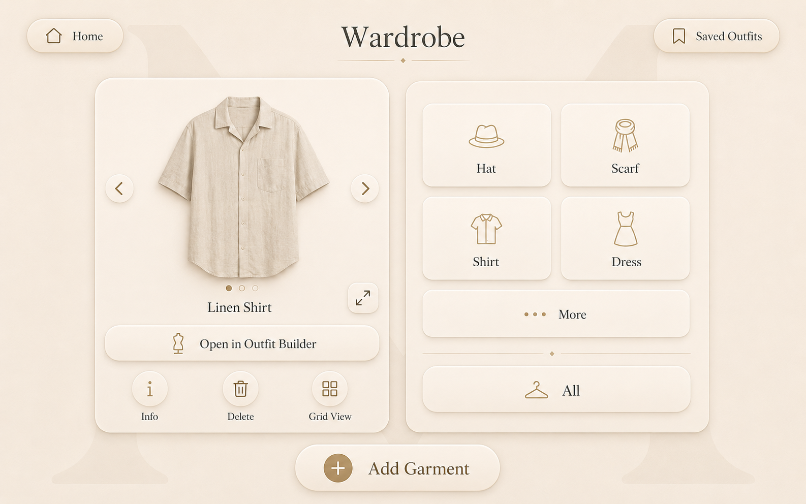

# Wardrobe Screen

## Purpose

The Wardrobe screen allows the user to browse, inspect, and select garments stored in Muse.

Its main purpose is to help the user choose a garment and begin building an outfit.

The screen must remain visual, direct, touch-friendly, and consistent with the Muse design system.

---

## Approved Visual Reference



This mockup is the official visual reference for the Wardrobe screen.

---

## Screen Summary

The Wardrobe screen can be explained in one sentence:

> Browse your clothing and choose a garment to use.

---

## Header

The upper section contains:

- A `Home` button in the upper-left corner
- The page title `Wardrobe` centered at the top
- A `Saved Outfits` button in the upper-right corner
- A small champagne divider beneath the title

### Home Button

The Home button returns directly to the Home screen.

It must preserve no temporary wardrobe navigation state unless explicitly required later.

### Saved Outfits Button

The Saved Outfits button opens the Saved Outfits screen directly.

It provides a useful shortcut without introducing a permanent navigation bar.

---

## Main Layout

The screen is divided into two primary sections:

1. Garment preview and actions on the left
2. Clothing category selection on the right

The two sections must remain visually balanced.

The left side is the primary working area.

The right side provides category navigation.

---

## Garment Preview

The left panel displays the currently selected garment.

It contains:

- Large garment image
- Previous garment button
- Next garment button
- Garment name
- Carousel position indicators
- Fullscreen button
- Open in Outfit Builder button
- Information button
- Delete button
- Grid View button

The garment image must occupy most of the panel.

The image should remain centered and preserve the garment's proportions.

---

## Garment Carousel

The selected category determines which garments appear in the carousel.

Example:

```text
Selected category: Shirt
Displayed items: Shirts only
```

The user can move through garments using:

- Left arrow
- Right arrow
- Swipe gesture

The left and right arrows must remain visible even when swipe interaction is supported.

### Carousel Indicators

Small circular indicators beneath the garment image show:

- The number of available images or items in the current carousel
- The currently selected position

The active indicator uses the champagne accent.

Inactive indicators use a muted beige tone.

---

## Garment Name

The current garment name appears beneath the carousel.

Examples:

```text
Linen Shirt
Black Hoodie
White Sneakers
```

The name must remain readable and visually connected to the garment preview.

---

## Fullscreen Mode

The fullscreen button expands the current category carousel.

When activated:

- The category panel disappears
- The garment preview expands
- The carousel occupies most of the screen
- Garments remain navigable through arrows and swipe
- A visible reduce button replaces the fullscreen button
- The user can return to the split layout

Fullscreen mode must preserve:

- Current category
- Current garment
- Current carousel position

The user must not lose context when leaving fullscreen mode.

---

## Open in Outfit Builder

The rectangular `Open in Outfit Builder` button is the primary action on the Wardrobe screen.

When pressed:

1. Muse opens the Outfit Builder.
2. The currently selected garment is added automatically.
3. The garment receives its separate suggested Outfit Builder body zone.
4. The Outfit Builder remembers that the user came from Wardrobe.
5. A contextual Wardrobe return button may appear in Outfit Builder.

Examples:

```text
Hat   → Head
Shirt → Upper body
Pants → Lower body
Shoes → Feet
```

The selected garment must remain available when the Outfit Builder opens.

---

## Quick Actions

Quick actions use round buttons.

### Information

The Information button opens the Clothing Details screen for the selected garment.

The Back button on Clothing Details must return to the same garment and category in Wardrobe.

### Delete

The Delete button removes the selected garment from Muse.

Before deletion:

- Display a confirmation dialog
- Show the garment name
- Explain that the action removes the item from the wardrobe

Deletion must not happen immediately after one accidental touch.

### Grid View

The Grid View button opens a fullscreen garment grid.

The grid must respect the currently selected category.

Example:

```text
Selected category: Shirt
Grid contents: Shirts only
```

If `All` is selected:

```text
Grid contents: All garments
```

The grid must include a clear control for returning to the split carousel layout.

---

## Category Panel

The right panel displays clothing categories as large touch cards.

Initial categories include:

- Hat
- Scarf
- Shirt
- Dress
- Pants
- Shoes
- Accessories
- Outerwear
- Other

The approved mockup initially displays:

- Hat
- Scarf
- Shirt
- Dress
- More
- All

The visible category layout may use a limited set of primary categories with a `More` button for additional categories.

---

## Category Interaction

When a category is selected:

1. The category becomes visually active.
2. The left carousel refreshes.
3. Only garments from the selected category appear.
4. The first available garment becomes selected.
5. The current category remains stored while navigating to Details and back.

The active category may use:

- Champagne outline
- Slightly stronger shadow
- Champagne icon
- Subtle surface change

The selected state must remain clear without using aggressive colors.

---

## More Categories

The `More` button opens the full category list.

This may appear as:

- A modal panel
- A fullscreen category view
- An expanded category section

The implementation must remain touch-friendly and visually consistent.

Opening More must not discard the currently selected garment.

---

## All Category

The `All` button displays every garment stored in the wardrobe.

When All is active:

- The carousel includes all categories
- Grid View displays all garments
- Items remain ordered consistently

Recommended ordering:

```text
Newest garment first
Oldest garment last
```

Alternative ordering may be added later, but sorting controls are not required for the MVP.

---

## Add Garment

The `Add Garment` button is positioned at the bottom center.

It is a large rectangular navigation button with:

- Plus icon
- Label: `Add Garment`
- Champagne accent

When pressed, it opens the garment import flow.

The button must remain clearly visible and easy to touch.

---

## Garment Import Entry

The Add Garment action opens a focused two-option method choice:

- **Upload on this device** opens the existing local image and metadata form.
- **Upload from phone** creates a short-lived local-network session.

Both options are enabled, explicit, and at least `56 × 56 px`. They reuse the
approved warm ivory, champagne, typography, icon, focus, and button language;
the choice does not redesign Wardrobe.

The device phone-upload view includes Back navigation, the Add Garment title, a
locally rendered QR code with a four-module quiet zone and high error
correction, the readable URL, network availability, remaining time, Cancel, and
Generate new code. Status text progresses through waiting, phone connected,
receiving, processing, complete, expired, cancelled, or failed and is announced
accessibly. The URL remains available if QR rendering fails.

Network availability is the bounded result of the main process probing the
restricted listener's exact configured address, not an inference from session
creation. An unavailable listener prevents code creation; a later failed probe
keeps the existing code visible but disables misleading ready copy and offers a
safe retry path.

Polling is bounded, slows after a retryable failure, and stops for completed,
cancelled, or expired sessions. Completion invalidates the Wardrobe collection
and opens the new garment automatically. A cancelled, expired, completed, or
superseded code cannot be reused. A failed attempt may retry only while the
server explicitly allows it. Technical host, database, filesystem, and server
diagnostics do not appear in the product UI.

The Wardrobe screen must refresh automatically after a new garment is saved.

The newly added garment should become visible immediately.

### Phone page

The separate mobile page uses a single-column layout at approximately
`390 × 844`. It displays Muse and **Add Garment**, a same-network reminder, a
large camera/file picker, image preview, replace/remove controls, required name,
category, derived body zone, and the bounded optional metadata supported by the
existing import contract. Primary touch targets are at least `56 × 56 px`.

Validation appears beside the relevant field. Transfer progress uses a native
progress element and live status text; preparing, uploading, processing,
complete, retryable failure, expired, and already-used states never rely on
color alone. Focus remains visible, reduced motion preserves all behavior, and
neither the phone nor device view may overflow horizontally.

The picker requests JPEG, PNG, or WebP and may offer direct camera capture where
the mobile browser supports it. HEIC and HEIF are not silently renamed or
partially accepted; the page explains how to capture or export a compatible
image when one is selected.

---

## Empty States

### Empty Wardrobe

When no garments exist:

- Keep the Wardrobe layout visible
- Display a simple explanation
- Emphasize the Add Garment button

Suggested message:

```text
Your wardrobe is empty.
Add your first garment to begin.
```

### Empty Category

When the selected category contains no garments:

```text
No garments in this category yet.
```

Provide a direct Add Garment action.

---

## Loading State

While garments are loading:

- Preserve the page structure
- Display a soft image placeholder
- Display subtle skeleton cards
- Keep navigation available where possible
- Avoid aggressive loading indicators

---

## Error State

If wardrobe data cannot be loaded:

- Display a clear message
- Offer Retry
- Keep Home accessible
- Do not expose technical errors to the user

Suggested message:

```text
Muse could not load your wardrobe.
Please try again.
```

---

## Touch Interaction

The Wardrobe screen must support:

- Large category cards
- Large carousel arrows
- Swipe navigation
- Large quick-action buttons
- Comfortable spacing
- No hover-dependent behavior

Accidental swipes must not trigger destructive actions.

---

## State Preservation

Muse must preserve the current Wardrobe state when the user:

- Opens Clothing Details
- Opens Outfit Builder
- Opens Grid View
- Enters fullscreen mode
- Returns from another screen

State includes:

- Selected category
- Selected garment
- Carousel position
- Grid or carousel mode
- Fullscreen state where appropriate

---

## Visual Rules

The Wardrobe screen must use:

- Warm ivory background
- Large low-contrast background `M`
- Champagne accent
- Rounded ivory cards
- Soft shadows
- Playfair Display for major titles
- Inter for interface labels
- No dark theme
- No bottom navigation bar
- No small mobile-style floating controls

The approved mockup is the visual source of truth.

---

## Accessibility

The screen must provide:

- Large touch targets
- Visible selected category state
- Accessible labels for icon buttons
- Keyboard navigation during development
- Clear confirmation before deletion
- Reduced-motion support
- Swipe alternatives through visible arrows

Suggested accessible labels:

```text
Previous garment
Next garment
Open garment fullscreen
Open garment details
Delete garment
Open garment grid
Open in Outfit Builder
Add garment
```

---

## Responsive Behavior

Primary target:

```text
1280 × 800 landscape touchscreen
```

At the target resolution:

- Both main panels remain visible
- The Add Garment button remains visible
- The garment image remains large
- Categories remain comfortable to press
- No horizontal page scrolling occurs

On smaller development screens:

- The panels may reduce proportionally
- Vertical scrolling may be allowed
- Touch targets must not become too small

Portrait mode is outside the MVP scope.

---

## Implementation Guidance

Suggested component structure:

```text
WardrobePage
├── PageHeader
│   ├── HomeButton
│   ├── PageTitle
│   └── SavedOutfitsButton
├── WardrobeLayout
│   ├── GarmentPreviewPanel
│   │   ├── GarmentCarousel
│   │   ├── CarouselIndicators
│   │   ├── GarmentName
│   │   ├── FullscreenButton
│   │   ├── OutfitBuilderButton
│   │   └── QuickActionGroup
│   └── CategoryPanel
│       ├── CategoryCard
│       ├── MoreCategoriesButton
│       └── AllGarmentsButton
├── AddGarmentButton
└── BackgroundMonogram
```

Possible routes:

```text
Home             → /
Saved Outfits    → /saved-outfits
Clothing Details → /wardrobe/:garmentId
Outfit Builder   → /outfit-builder
Import Method    → /wardrobe/add
Device Import    → /wardrobe/add/device
Phone Import     → /wardrobe/add/phone
```

---

## Definition of Done

The Wardrobe screen is complete when:

- The layout matches the approved mockup.
- Home and Saved Outfits navigation work.
- Categories filter garments correctly.
- Carousel arrows and swipe work.
- The active garment remains clearly visible.
- Fullscreen mode works and preserves state.
- Grid View respects the selected category.
- Clothing Details opens the correct garment.
- Delete requires confirmation.
- Open in Outfit Builder transfers the garment correctly.
- Add Garment opens the import flow.
- State is preserved when returning from related screens.
- The screen works without Internet access.
- The interface remains smooth on Raspberry Pi.
